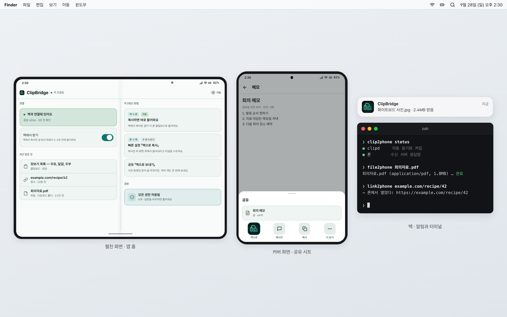
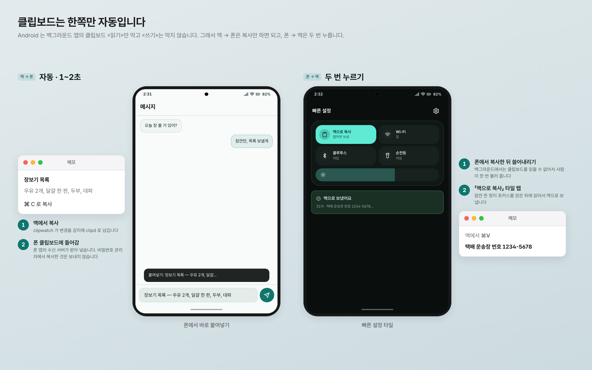
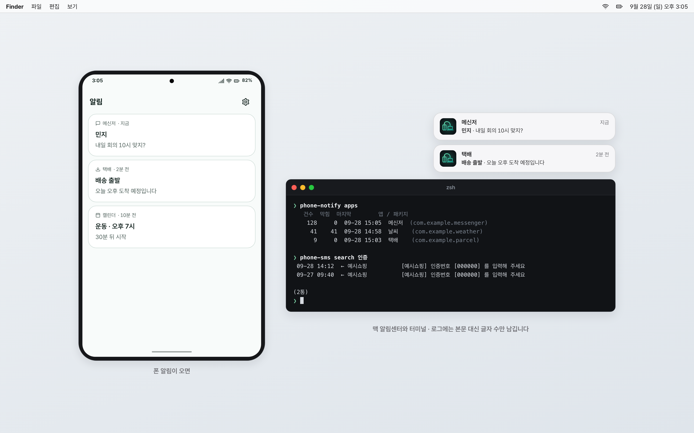
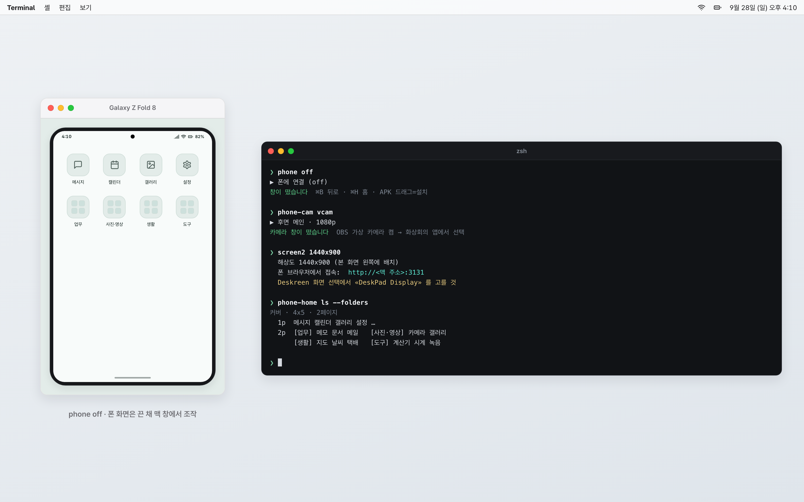
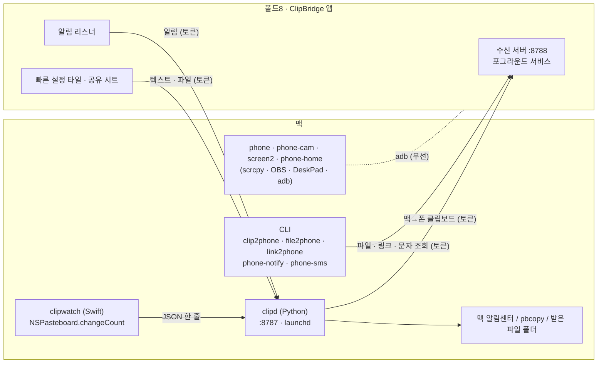

# ClipBridge

맥과 갤럭시 폴드8 사이에서 클립보드·파일·링크·알림·문자를 주고받는 폰 앱 + 맥 서버 + CLI 모음입니다.

> **English** — ClipBridge is a small Android app, a macOS server (`clipd`) and a set of shell tools that recreate iPhone-style Mac continuity for a Galaxy Z Fold8 over Tailscale.
> Mac → phone clipboard sync is fully automatic; phone → Mac takes two taps (Android blocks background clipboard reads, not writes). Files, links, notification mirroring and read-only SMS search are included.
> It also ships wrappers for scrcpy mirroring, using the phone as a second display or webcam, a One UI home-screen folder tool, and a Claude Code skill (`skills/foldphone`).

동작 확인: Galaxy Z Fold8 (Android 17) · macOS 26

## 왜 만들었나

저는 10년 가까이 아이폰을 쓰다가 갤럭시 Z 폴드8로 바꿨습니다. 폰 자체는 만족스러웠는데, 맥북과 함께 쓸 때 아이폰에서 당연하던 것들이 없었습니다. 맥에서 복사한 걸 폰에 붙여넣기(Universal Clipboard), 파일 넘기기(AirDrop), 폰 문자·알림을 맥에서 보기 같은 것들입니다.

기성 앱을 찾아보기 전에, 안드로이드는 앱을 직접 만들어 바로 깔 수 있다는 점을 시험해 보고 싶었습니다. 그래서 Claude Code 와 함께 필요한 것만 하나씩 만들었고, 그 결과가 이 저장소입니다. 제 폰과 제 맥 한 쌍에서 매일 쓰는 개인 도구이고, 범용 제품은 아닙니다.

## 스크린샷


화면은 설명용 목업입니다.


화면은 설명용 목업입니다.


화면은 설명용 목업입니다.


화면은 설명용 목업입니다.

## 기능

| 하고 싶은 것 | 방법 | 비고 |
|---|---|---|
| 맥 → 폰 텍스트 | **자동.** 맥에서 복사하면 1~2초 안에 폰 클립보드에 들어갑니다. 수동은 `clip2phone [텍스트]` | 비밀번호 관리자가 붙이는 concealed 표시가 있으면 보내지 않습니다 |
| 폰 → 맥 텍스트 | 복사 → 빠른 설정 쓸어내리기 → 「맥으로 복사」 타일. 또는 공유 시트 「맥으로 보내기」 | 두 번 누르기가 필요합니다(아래 「알려진 한계」) |
| 폰 → 맥 파일 | 공유 시트 「맥으로 보내기」(사진·동영상·문서, 여러 개 한 번에) | 맥의 `CLIPBRIDGE_INBOX` 폴더로 들어갑니다 |
| 맥 → 폰 파일 | `file2phone <파일…>` | 폰 「다운로드」에 저장되고 알림을 누르면 열립니다 |
| 맥 → 폰 링크 | `link2phone [url]` | 「다른 앱 위에 표시」를 허용하면 바로 열리고, 아니면 알림으로 옵니다 |
| 폰 알림 → 맥 | 폰에서 알림 접근을 허용하면 맥 알림센터에 뜹니다. `phone-notify apps / deny / allow / only` 로 앱별로 거릅니다 | 알림 본문은 맥 로그에 남기지 않습니다 |
| 문자 읽기 | `phone-sms` · `phone-sms read <번호>` · `phone-sms search <키워드>` | 읽기 전용이 기본. `send` 는 매번 확인을 묻고, 실제 발송은 검증하지 않았습니다 |
| 폰 화면 미러링 | `phone` · `phone off`(폰 화면은 끈 채) · `phone light` · `phone stop` | scrcpy 래퍼. APK 를 창에 끌어다 놓으면 설치됩니다 |
| 폰을 맥 보조 모니터로 | `screen2 [해상도]` · `screen2 stop` | DeskPad(가상 디스플레이) + Deskreen CE(브라우저 스트리밍). 보기 전용 |
| 폰 카메라를 맥 웹캠으로 | `phone-cam` · `phone-cam vcam`(OBS 가상 카메라까지) · `stop / off / status` | 끊기면 스스로 다시 붙습니다 |
| 홈 화면 폴더 정리 | `phone-home ls --folders` · `folder` · `add` · `rename` · `pull` · `move` · `drop-empty-pages` | 루트 없이 사람 손동작을 adb 로 흉내 냅니다. 위험 버튼 옆은 OCR 로 확인한 뒤에만 누릅니다 |
| 앱 빌드·설치 | `clipbridge-deploy` | 빌드 → 설치 → 앱 실행 → 수신 서버·권한 확인 |
| Claude Code 에게 맡기기 | `skills/foldphone/` 를 `~/.claude/skills/` 에 복사 | 「이거 폰으로 보내줘」 같은 말을 위 명령으로 연결합니다 |

## 구조



- 맥과 폰은 **Tailscale** 로만 이야기합니다. `clipd` 와 폰 수신 서버는 둘 다 Tailscale 주소(100.64/10)에만 바인딩합니다.
- 두 서버 모두 `X-ClipBridge-Token` 헤더를 확인합니다(`clipd` 는 `GET /health` 만 예외).
- 폰 쪽을 adb 가 아니라 앱(포그라운드 서비스 + WifiLock)으로 둔 이유: adb 는 폰이 절전에 들어가면 자주 끊깁니다. 앱 방식은 화면이 꺼진 Doze 상태에서 15분 연속 전송에 성공했습니다.

```
android/      폰 앱 (Kotlin + Jetpack Compose, minSdk 30 · compileSdk 36)
server/       clipd.py · clipwatch.swift · install-launchd.sh
cli/          명령들 + clipbridge-env.sh(공통 설정) · lib-device.sh(무선 adb 연결) · install.sh
skills/       foldphone — Claude Code 스킬
docs/         목업 HTML(docs/mockups) · 이미지(docs/images)
```

## 준비물

- macOS 26 맥, Galaxy Z Fold8(다른 안드로이드 11+ 폰도 앱 자체는 돌 것으로 보지만 확인하지 않았습니다)
- 맥과 폰에 같은 계정의 [Tailscale](https://tailscale.com)
- JDK 21 · Android SDK(platform-tools, build-tools) — Android Studio 없이 Gradle 명령줄로 빌드합니다
- Python 3 · Xcode Command Line Tools(`swiftc`)
- 선택: [terminal-notifier](https://github.com/julienXX/terminal-notifier)(알림을 앱별로 묶어 보여 줍니다), [scrcpy](https://github.com/Genymobile/scrcpy) 4.x(`phone`·`phone-cam`), OBS(`phone-cam vcam`), DeskPad·Deskreen CE·displayplacer(`screen2`)

## 설치와 설정

**1. 설정 파일**

```bash
mkdir -p ~/.config/clipbridge
cp config.example.env ~/.config/clipbridge/clipbridge.env
# CLIPBRIDGE_MAC_HOST   맥의 Tailscale 주소 (tailscale ip -4)
# CLIPBRIDGE_PHONE_HOST 폰의 Tailscale 주소
# CLIPBRIDGE_TOKEN      openssl rand -hex 24 로 만든 값
```

맥의 `clipd`, `cli/` 의 모든 명령, 폰 앱 빌드가 이 파일 하나를 봅니다. 폰 앱만 따로 빌드하려면 `android/clipbridge.properties.example` 을 `clipbridge.properties` 로 복사해 같은 값을 넣어도 됩니다(커밋되지 않습니다).

**2. 맥 서버**

```bash
swiftc -O -o server/clipwatch server/clipwatch.swift   # 맥 → 폰 자동 동기화용 감시자
server/install-launchd.sh                              # 로그인할 때 clipd 가 뜨도록 등록
cli/install.sh                                         # 명령들을 ~/.local/bin 에 링크
```

로그·알림 통계·필터 상태는 `~/.local/state/clipbridge/` 에 쌓입니다. 저장소 안에는 아무것도 쓰지 않습니다.

**3. 폰 앱**

폰에서 무선 디버깅으로 adb 를 한 번 연결한 뒤:

```bash
clipbridge-deploy
```

빌드·설치·앱 실행·수신 서버 확인까지 합니다. adb 가 안 될 때는 폰 브라우저로 `http://<맥 주소>:8787/?token=<토큰>` 을 열어 APK 를 받을 수도 있습니다.

**4. 권한**(폰 앱 화면에서 하나씩 허용하거나 adb 로)

```bash
adb shell appops set kr.joonlab.clipbridge SYSTEM_ALERT_WINDOW allow   # 링크 바로 열기
adb shell cmd notification allow_listener kr.joonlab.clipbridge/kr.joonlab.clipbridge.NotifyMirror
adb shell pm grant kr.joonlab.clipbridge android.permission.READ_SMS   # 문자 읽기
```

알림 접근과 문자 권한은 민감합니다. 필요한 것만 켜세요.

## 보안과 위협 모델

이 도구는 **내 tailnet 안의 내 기기끼리**를 전제로 합니다. 그 전제에서 막는 것과 못 막는 것을 적어 둡니다.

- **tailnet 밖**: 두 서버 모두 Tailscale 인터페이스에만 바인딩하므로 공용 Wi-Fi 의 다른 기기에서는 포트가 보이지 않습니다. 통신은 WireGuard 로 암호화되므로 앱의 평문 HTTP 예외도 맥 주소 하나에만 둡니다.
- **tailnet 안의 다른 기기·같은 폰의 다른 앱**: 공유 토큰으로 막습니다. 처음 만들 때 맥 `clipd` 는 알림 수신(`/notify`)만 토큰을 확인했고, `/clip`(맥 클립보드 읽기·쓰기)과 `/file` 은 tailnet 바인딩에만 기대고 있었습니다. 공개본에서는 `GET /health` 를 뺀 모든 엔드포인트가 토큰을 요구하도록 고쳤습니다.
- **못 막는 것**: 토큰은 폰 APK 안(`BuildConfig`)과 맥 설정 파일에 평문으로 있습니다. 폰이나 맥 자체를 가진 사람, tailnet 에 기기를 추가할 수 있는 사람은 막지 못합니다. tailnet 을 다른 사람과 공유한다면 Tailscale ACL 로 포트 8787·8788 을 내 기기끼리만 열어 두세요.
- **문자**: `phone-sms send` 는 폰이 대신 문자를 보냅니다. 기본으로 매번 확인을 묻지만, 토큰을 가진 쪽은 `/sms` 를 직접 부를 수 있습니다. 필요 없으면 SEND_SMS 권한을 주지 마세요.
- **로그**: 맥 로그에는 클립보드·알림의 **내용 대신 글자 수**만 남깁니다. 비밀번호 관리자에서 복사한 항목(concealed)은 폰으로 보내지 않습니다.
- 폰 앱의 `ClipReceiver`(`kr.joonlab.clipbridge.SET_CLIP` 방송)는 adb 시험용으로 열려 있어, 같은 폰의 다른 앱도 폰 클립보드를 **쓸** 수 있습니다(읽기는 아님).

## 알려진 한계

- **폰 → 맥 클립보드는 완전 자동이 안 됩니다.** Android 10+ 는 포커스가 없는 앱의 클립보드 읽기를 막고, Android 17 에서 로그 읽기 + 오버레이 우회도 `Denying clipboard access … not in focus` 로 막히는 것을 확인했습니다. 그래서 타일을 눌러 잠깐 창을 띄운 뒤 읽는 두 동작 방식입니다. KDE Connect 도 같은 이유로 타일 방식을 씁니다.
- 문자 **발송**은 권한과 확인 절차까지만 만들었고 실제 발송은 검증하지 않았습니다.
- `phone-cam` 은 폰 카메라 앱과 동시에 쓸 수 없습니다(동시에 열 수 있는 카메라 개수 한도). 화상회의 앱에서 실제 통화로 확인하는 일은 아직 못 했습니다.
- `screen2` 는 보기 전용입니다(Deskreen 이 터치를 넘기지 않습니다). 브라우저 디코딩 지연이 있습니다.
- `phone-home` 은 One UI 런처의 라벨과 resource-id 에 기대므로 런처가 바뀌면 깨질 수 있습니다. `ls`·`pull` 외의 쓰기 명령은 CLI 형태로는 충분히 돌려 보지 못했습니다.
- 맥과 폰이 한 쌍이라는 전제입니다. 폰 여러 대, 맥 여러 대는 고려하지 않았습니다.
- 폰 온디바이스 전사(삼성 음성녹음 앱 자동화)는 이 저장소에서 뺐습니다. 별도 저장소로 공개합니다.

## 만든 과정

2026년 9월 20일부터 22일까지 Claude Code 와 사흘 동안 대부분을 만들었고, 이후 며칠에 걸쳐 앱 화면을 다시 만들고 홈 화면 정리 도구를 붙였습니다. 기억에 남는 삽질은 이렇습니다.

1. **클립보드는 읽기만 막히고 쓰기는 열려 있었습니다.** 처음에는 폰 → 맥 자동화에 매달렸다가 Android 17 에서 막힌 것을 확인했습니다. 반대로 맥 → 폰은 `setPrimaryClip` 이 포커스 없이도 되는 것을 실측하고, 폰에 작은 수신 서버를 두는 쪽으로 방향을 틀었습니다. 한쪽이 막혔다고 양쪽을 다 포기할 필요는 없었습니다.
2. **조용히 실패하는 API 가 많았습니다.** 평문 HTTP 차단, MediaStore 가 `.apk` 에 `.zip` 을 덧붙이는 동작, 백그라운드 액티비티 실행 제한은 모두 예외 없이 실패합니다. 「보냈다」를 성공으로 믿지 않고, 넣은 값을 다시 읽어 대조하는 습관이 생겼습니다.
3. **네트워크 문제는 Tailscale 로 한 번에 풀렸습니다.** 공용 Wi-Fi 의 AP 격리 때문에 무선 디버깅이 안 되던 것을, Tailscale 을 쓰자는 제 제안으로 전환하면서 해결했습니다. 그 뒤로는 어느 망에 있든 주소가 같습니다.
4. **맥 셸 스크립트의 조용한 실패.** macOS 의 BSD grep 은 `\s` 를 모르고, `set -e` 아래에서 `var=$(grep …)` 가 매치 없이 끝나면 스크립트가 아무 말 없이 종료됩니다. 한동안 핫스팟 연결이 안 되는 원인을 네트워크에서 찾았는데 실제 원인은 이것이었습니다.

그 밖에 쓴 것: 보조 모니터용 Wi-Fi 를 2.4GHz 에서 5GHz 로 옮기자 평균 ping 이 17.6ms 에서 11.9ms 로 줄었습니다.

## 홍보 영상

<!-- VIDEO -->

## 관련 프로젝트

- 허브: https://github.com/joonlab/android-mac-lab — 폴드8 ↔ 맥 연동 실험 전체 목록

## 라이선스

MIT — [LICENSE](LICENSE). 앱에 들어 있는 Pretendard 글꼴은 SIL Open Font License 1.1 입니다([third_party/Pretendard-OFL.txt](third_party/Pretendard-OFL.txt)).
